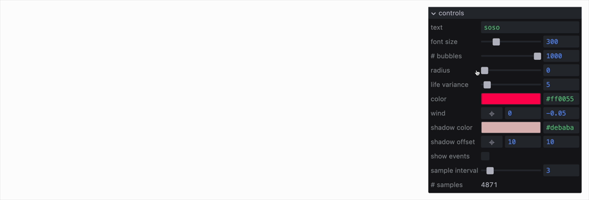

# soso-panel



A declarative, event-driven graphical interface for monitoring and modifying JavaScript variables.

[Examples](http://sophia-ooo.github.io/soso-panel/examples/) • [API](docs/api.md) • [Controls](docs/controls.md)

```js
import Soso from "soso-panel";

// Create a panel
const panel = Soso.create([
    { id: "speed", type: "range", min: 0, max: 10, value: 5 },
    { id: "color", type: "color", value: "#ff0055" },
    { id: "debug", type: "toggle", value: false },
]);

// Listen to changes
panel.subscribe((id, value) => {
    console.log(`${id} changed to:`, value);
});

// Update values
panel.set({ speed: 7 });

// Get current values
const { speed, color, debug } = panel.get();
```

## Installation

```bash
npm install soso-panel
```

## Why soso-panel?

soso-panel is built on three principles:

- **Predictable state flow** — Changes emit events. You handle them.
- **Serializable configuration** — Define UI as JSON. Save, version, generate.
- **Simple, extensible API** — A 7-method API. Add custom controls and styles.

## API

- [`Soso.create(config[, options])`](docs/api.md#sosocreateconfig-options)
- [`Soso.register(type, component[, options])`](docs/api.md#sosoregistertype-component-options)
- [`panel.get()`](docs/api.md#panelget)
- [`panel.set(values[, options])`](docs/api.md#panelsetvalues-options)
- [`panel.update(updates[, options])`](docs/api.md#panelupdateupdates-options)
- [`panel.subscribe(id, handler)`](docs/api.md#panelsubscribeid-handler)
- [`panel.subscribe(handler)`](docs/api.md#panelsubscribehandler)
- [`panel.destroy()`](docs/api.md#paneldestroy)

See the [full API documentation](docs/api.md).

## Controls

- [Input Controls](docs/controls.md#input-controls) – `range`, `number`, `text`, `color`, `toggle`, `pad2`
- [Selection Controls](docs/controls.md#selection-controls) – `select`, `buttons`
- [Action Controls](docs/controls.md#action-controls) – `button`
- [Display Controls](docs/controls.md#display-controls) – `display`, `graph`
- [Layout Controls](docs/controls.md#layout-controls) – `group`

See the [full controls reference](docs/controls.md).

## Theming

soso-panel uses CSS custom properties for easy theming. Apply themes with the `classNames` option:

```js
const panel = Soso.create(controls, {
    classNames: ["dark-theme", "compact"],
});
```

See the [theming reference](docs/theming.md) for available CSS variables and examples.

## Building

```bash
npm install        # Install dependencies
npm run build      # Build the library
npm run build:all  # Build library and examples
```

## Status

- **Early release (v0.1.0)** - The core API is usable today but may evolve.
- **Deliberately minimal** - soso-panel focuses on JSON-declared controls and event output. That's it.
- **Modern browser focus** - Relies on recent CSS/JS features (e.g. `interpolate-size` for height resize). It works on mobile, but tap targets and layout are tuned for desktop.
- **No TypeScript** - PRs welcome.

## License

MIT
